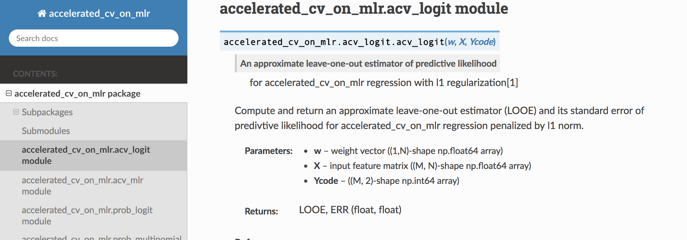

# AcceleratedCVonMLR_Python
AcceleratedCVonMLR_Python is a Python module for approximate cross-validation for multinomial logistic regression with *L1*-penalty.

This is a free software, you can redistribute it and/or modify it under the terms of the GNU General Public License, version 3 or above. See LICENSE.txt for details.

This program is distributed in the hope that it will be useful, but WITHOUT ANY WARRANTY; without even the implied warranty of MERCHANTABILITY or FITNESS FOR A PARTICULAR PURPOSE.

# INSTALL
* Compile from sourse
```bash
git clone https://github.com/T-Obuchi/AcceleratedCVonMLR_python.git
cd AcceleratedCVonMLR_python
python setup.py install
```

* currentry, pip installation is not supported yet.

# DESCRIPTION
Using estimated weight vectors *wV* given the feature data *X* and the class *Ycode* for multinomial logistic regression penalized by *L1* norm, this program computes and returns an approximate leave-one-out estimator (LOOE) and its standard error of predictive likelihood. All required modules are in the "accelerated_cv_on_mlr" package. Note that this program itself does not contain any solver to obtain *wV*. Please use other distributed programs for the purpose.

# Requirement
* NumPy
    - the modules use NumPy arrays
    - URL: https://github.com/numpy/numpy

* glmnet_py
    - sample notebook uses glmnet_python module for logistic regression to get weight vector *wV*
    - URL: https://github.com/bbalasub1/glmnet_python    

* Matplotlib
    - sample notebook uses Matplotlib module for the result visualization
    - URL: https://github.com/matplotlib/matplotlib

# USAGE
## multinomial case
For multinomial logistic regression with *Np* (*>2*) classes,
```python
import accelerated_cv_on_mlr as acv
[LOOE,ERR] = acv.acv_mlr(wV, X, Ycode, Np)
```
* Arguments and Returns
    * Arguments:
        - *wV*: weight vectors (p, N)-shape np.float64 array
        - *X*: input feature matrix (M, N)-shape np.float64 array
        - *Ycode*: class representative binary matrix (M, p)-shape np.int64 array
        - *Np*: number of classes

    * Returns:
        - *LOOE*: Approximate value of the leave-one-out estimator
        - *ERR*: Approximate standard error of the leave-one-out estimator

## binomial case
For binomial logistic regression (logit model),
```python
import accelerated_cv_on_mlr as acv
[LOOE,ERR] = acv.acv_logit(w, X, Ycode)
```
* Arguments and Returns
    * Arguments:
        - *w*: weight vector ((1,N)-shape np.float64 array)
        - *X*: input feature matrix ((M, N)-shape np.float64 array)
        - *Ycode*: binary matrix representing the class to which the corresponding feature vector belongs ((M, 2)-shape np.int64 array)
    * Returns:
        - *LOOE*: Approximate value of the leave-one-out estimator
        - *ERR*: Approximate standard error of the leave-one-out estimator


Inputs:
- *wV*: the estimated weight vector of *N* dimensional
- *X*: the set of feature vectors  of *M* * *N* dimensional
- *Ycode*: the *M* * *2* dimensional binary matrix representing the class to which the corresponding feature vector belongs

Outputs are the same as the multinomial case. The  further simplified approximation for the logit model is implemented in *saacv_logit*.


* For more details, see docstrings.
```python
acv.acv_mlr?
acv.acv_logit?
```

* or see the api-documentation:
    - (PATH_TO_AcceleratedCVonMLR_python)/docs/_build/_html/index.html 

# DEMONSTRATION
In the "sample" folder, demonstration Jupyter notebooks for the multinomial and binomial logistic regressions, sample_logit.ipynb and sample_mlr.ipynb, respectively, are available.

# REFERENCE
Tomoyuki Obuchi and Yoshiyuki Kabashima: "Accelerating Cross-Validation in Multinomial Logistic Regression with $ell_1$-Regularization", arXiv: 1711.05420